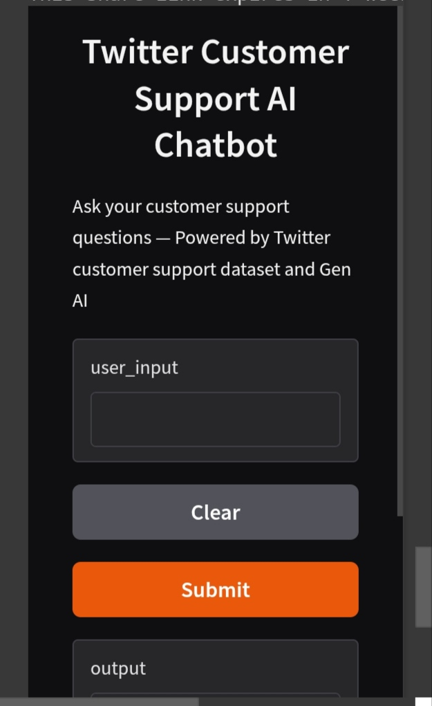

# Revolutionizing Customer Support with an Intelligent Chatbot

This project aims to build an AI-powered customer support chatbot trained on real-world Twitter conversations between customers and brands. It leverages natural language processing (NLP) and machine learning techniques to classify intent, analyze sentiment, and generate intelligent responses — automating the customer service experience.

## Dataset

- **Name:** Twitter Customer Support Dataset
- **Source:** [Kaggle](https://www.kaggle.com/datasets/thoughtvector/customer-support-on-twitter)
- **Description:** The dataset contains real support-based tweet conversations, including messages from customers (`inbound = True`) and responses from brands.

## Features Used

- `text` - Customer query or message
- `response` - Brand reply (optional for training generation)
- `inbound` - Boolean flag to identify if message is from a customer
- `author_id`, `created_at` - Metadata

---

## Project Goals

- Clean and preprocess customer support conversation data
- Classify customer **intent** (e.g., refund request, delivery delay)
- Analyze customer **sentiment** (e.g., frustrated, neutral, happy)
- Generate smart and appropriate **chatbot responses**
- Evaluate model accuracy and usability in real-world scenarios

---

## Technologies Used

- **Language:** Python
- **IDE:** Google Colab
- **Libraries:**
  - `pandas`, `numpy` – Data processing
  - `scikit-learn` – Model building
  - `nltk` – Text preprocessing
  - `transformers` – Pretrained conversational models
  - `gradio` – Chatbot frontend

---

## How to Run

1. **Clone this repository** or upload the notebook to [Google Colab](https://colab.research.google.com).
2. **Upload the dataset:**  
   Use the Kaggle Twitter Support Dataset (`customer_support_tweets.csv`).
3. **Run each cell** in the notebook step-by-step.
4. The chatbot UI will launch using Gradio — interact with the chatbot directly.

---

## Folder Structure

. ├── Twitter_Customer_Support_Chatbot.ipynb   # Main Colab notebook ├── README.md                                # Project readme file └── customer_support_tweets.csv              # Dataset file (upload to Colab)

---

## Sample Screenshot

---

## Future Improvements

- Fine-tune the model using domain-specific support data
- Add multi-turn conversation flow
- Integrate multilingual support (bitext)
- Deploy using Flask/Streamlit for production

---

## Team

- **Rajesh** – Project Lead, Developer

---

## License

This project is for educational and research purposes.

